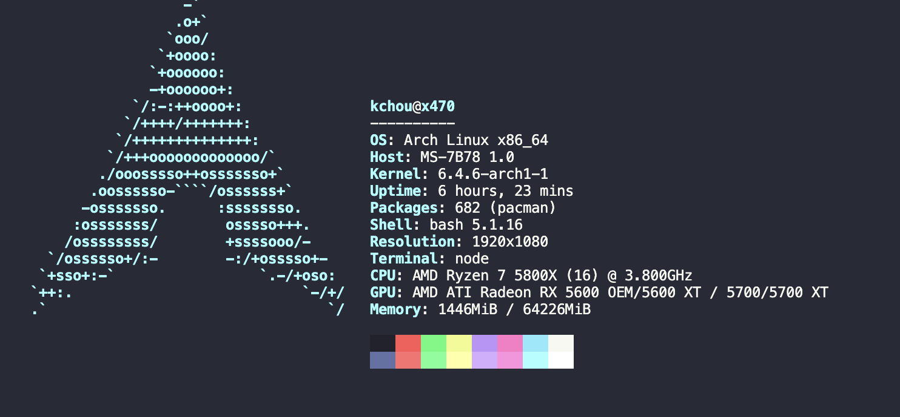

# Arch Linux Development Ansible Playbook

Install arch by [archlinux/archinstall](https://github.com/archlinux/archinstall), remenber install  external packages `openssh` and `ansible`



```bash
$ lsblk
NAME        MAJ:MIN RM   SIZE RO TYPE MOUNTPOINTS
nvme1n1     259:0    0   1.9T  0 disk
└─nvme1n1p1 259:1    0   1.9T  0 part /data
nvme0n1     259:2    0 931.5G  0 disk
├─nvme0n1p1 259:3    0   511M  0 part /boot
└─nvme0n1p2 259:4    0   931G  0 part /var/log
                                      /var/cache/pacman/pkg
                                      /home
                                      /.snapshots
                                      /
$ sudo btrfs subvolume list /
ID 256 gen 389 top level 5 path @
ID 257 gen 389 top level 5 path @home
ID 258 gen 389 top level 5 path @log
ID 259 gen 371 top level 5 path @pkg
ID 260 gen 11 top level 5 path @.snapshots
ID 261 gen 17 top level 256 path var/lib/portables
ID 262 gen 18 top level 256 path var/lib/machines
```

## Usage

```bash
ansible-galaxy install -r requirements.yml
```

```bash
ansible-playbook -i inventory main.yml -K
```

originally inspired by [geerlingguy/mac-dev-playbook](https://github.com/geerlingguy/mac-dev-playbook)
